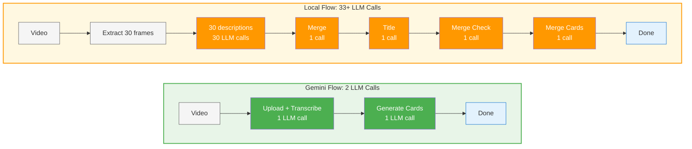

<div align="center">
  
</div>

<div align="center">
  <em>A timeline of your day, automatically.</em><br>
  Turns your screen activity into a clean timeline with AI summaries and distraction highlights.
</div>

<div align="center">
  <!-- Badges -->
  
  
  
  
  
</div>

<div align="center">
  
</div>

<div align="center">
  <a href="https://github.com/JerryZLiu/Dayflow/releases/latest">
    
  </a>
</div>

<p align="center">
  <a href="#quickstart">Quickstart</a> •
  <a href="#why-i-built-dayflow">Why I built Dayflow</a> •
  <a href="#features">Features</a> •
  <a href="#how-it-works">How it works</a> •
  <a href="#installation">Installation</a> •
  <a href="#data--privacy">Data & Privacy</a> •
  <a href="#debug--developer-tools">Debug & Developer Tools</a> •
  <a href="#auto-updates-sparkle">Auto‑updates</a> •
  <a href="#contributing">Contributing</a>
</p>

---

## What is Dayflow?

Dayflow is a **native macOS app** (SwiftUI) that records your screen at **1 FPS**, analyzes it **every 15 minutes** with AI, and generates a **timeline** of your activities with summaries. 
It's lightweight (25MB app size) and uses ~100MB of RAM and <1% cpu. 

> _Privacy‑minded by design_: You choose your AI provider. Use **Gemini** (bring your own API key) or **local models** (Ollama / LM Studio). See **Data & Privacy** for details.


## Why I built Dayflow

I built Dayflow after realizing that my calendar wasn't the source of truth for how I actually spent my time. My screen was. I wanted a calm, trustworthy timeline that let me see my workday without turning into yet another dashboard I had to maintain.

Dayflow stands for ownership and privacy by default. You control the data, you choose the AI provider, and you can keep everything local if that's what makes you comfortable. It's MIT licensed and fully open source because anything that watches your screen all day should be completely transparent about what it does with that information. The app should feel like a quiet assistant: respectful of your attention, honest about what it captures, and easy to shut off.


---

## Features

- **Automatic timeline** of your day with concise summaries.
- **1 FPS recording** - minimal CPU/storage impact.
- **15-minute analysis intervals** for timely updates.
- **Watch timelapses of your day**.
- **Auto storage cleanup** - removes old recordings after 3 days.
- **Distraction highlights** to see what pulled you off‑task.
- **Native UX** built with **SwiftUI**.
- **Auto‑updates** with **Sparkle** (daily check + background download).

### Coming soon

- **Infinitely customizable dashboard** — ask any question about your workday, pipe the answers into tiles you arrange yourself, and track trends over time.

  <div align="center">
    
  </div>

- **Daily journal** — review the highlights Dayflow captured, reflect with guided prompts, and drop screenshots or notes alongside your generated timeline.

  <div align="center">
    
  </div>

## How it works

1) **Capture** — Records screen at 1 FPS in 15-second chunks.
2) **Analyze** — Every 15 minutes, sends recent footage to AI.
3) **Generate** — AI creates timeline cards with activity summaries.
4) **Display** — Shows your day as a visual timeline.
5) **Cleanup** — Auto-deletes recordings older than 3 days.

### AI Processing Pipeline

The efficiency of your timeline generation depends on your chosen AI provider:



**Gemini** leverages native video understanding for direct analysis, while **Local models** reconstruct understanding from individual frame descriptions - resulting in dramatically different processing complexity.


---

## Quickstart

**Download (end users)**
1. Grab the latest `Dayflow.dmg` from **GitHub Releases**.
2. Open the app; grant **Screen & System Audio Recording** when prompted:  
   macOS → **System Settings** → **Privacy & Security** → **Screen & System Audio Recording** → enable **Dayflow**.

<div align="center">
  <a href="https://github.com/JerryZLiu/Dayflow/releases/latest">
    
  </a>
</div>

**Build from source (developers)**
1. Install **Xcode 15+** and open `Dayflow.xcodeproj`.
2. Run the `Dayflow` scheme on macOS 13+.
3. In your Run **scheme**, add your `GEMINI_API_KEY` under _Arguments > Environment Variables_ (if using Gemini).

---

## Installation

### Requirements
- macOS **13.0+**
- Xcode **15+**
- A **Gemini API key** (if using Gemini): https://ai.google.dev/gemini-api/docs/api-key

### From Releases
1. Download `Dayflow.dmg` and drag **Dayflow** into **Applications**.
2. Launch and grant the **Screen & System Audio Recording** permission.

<div align="center">
  <a href="https://github.com/JerryZLiu/Dayflow/releases/latest">
    
  </a>
</div>

### From source
```bash
git clone https://github.com/JerryZLiu/Dayflow.git
cd Dayflow
open Dayflow.xcodeproj
# In Xcode: select the Dayflow target, configure signing if needed, then Run.
```

---

## Data & Privacy

This section explains **what Dayflow stores locally**, **what leaves your machine**, and **how provider choices affect privacy**.

### Data locations (on your Mac)
- **App support folder:** `~/Library/Application Support/Dayflow/`
- **Recordings (video chunks):** `~/Library/Application Support/Dayflow/recordings/`
- **Local database:** `~/Library/Application Support/Dayflow/chunks.sqlite`
- **Recording details:** 1 FPS capture, analyzed every 15 minutes, 3-day retention
- **Purge / reset tip:** Quit Dayflow. Then delete the entire `~/Library/Application Support/Dayflow/` folder to remove recordings and analysis artifacts. Relaunch to start fresh.

> These paths are created by the app at first run. If you package Dayflow differently or run in a sandbox, paths may vary slightly.

### Processing modes & providers
- **Gemini (cloud, BYO key)** — Dayflow sends batch payloads to **Google’s Gemini API** for analysis.
- **Local models (Ollama / LM Studio)** — Processing stays **on‑device**; Dayflow talks to a **local server** you run.

### TL;DR: Gemini data handling (my reading of Google’s ToS)
- **Short answer: There is a way to prevent Google from training on your data.** If you **enable Cloud Billing** on **at least one** Gemini API project, Google treats **all of your Gemini API and Google AI Studio usage** under the **“Paid Services”** data‑use rules — **even when you’re using unpaid/free quota**. Under Paid Services, **Google does not use your prompts/responses to improve Google products/models**.  
  - Terms: “When you activate a Cloud Billing account, all use of Gemini API and Google AI Studio is a ‘Paid Service’ with respect to how Google Uses Your Data, even when using Services that are offered free of charge.” ([Gemini API Additional Terms](https://ai.google.dev/gemini-api/terms#paid-services-how-google-uses-your-data))  
  - Abuse monitoring: even under Paid Services, Google **logs prompts/responses for a limited period** for **policy enforcement and legal compliance**. ([Same Terms](https://ai.google.dev/gemini-api/terms#paid-services-how-google-uses-your-data))  
  - **EEA/UK/Switzerland:** the **Paid‑style data handling applies by default** to **all Services** (including AI Studio and unpaid quota) **even without billing**. ([Same Terms](https://ai.google.dev/gemini-api/terms#unpaid-services-how-google-uses-your-data))

**A couple useful nuances** (from docs + forum clarifications):
- **AI Studio is still free** to use; enabling billing changes **data handling**, not whether Studio charges you. ([Pricing page](https://ai.google.dev/gemini-api/docs/pricing))  
- **UI “Plan: Paid” check:** In **AI Studio → API keys**, you’ll typically see “Plan: Paid” once billing is enabled on any linked project (UI may evolve).  
- **Free workaround:** _“Make one project paid, keep using a free key elsewhere to get the best of both worlds.”_ The **Terms** imply **account‑level** coverage once any billing account is activated, but the **Apps** nuance above may limit this in specific UI contexts. **Treat this as an interpretation, not legal advice.**

### Local mode: privacy & trade‑offs
- **Privacy:** With **Ollama/LM Studio**, prompts and model inference run on your machine. LM Studio documents full **offline** operation once models are downloaded.  
- **Quality/latency:** Local open models are improving but **can underperform** cloud models on complex summarization.  
- **Power/battery:** Local inference is **GPU‑heavy** on Apple Silicon and will drain battery faster; prefer **plugged‑in** sessions for long captures.  
- **Future:** We may explore **fine‑tuning** or distilling a local model for better timeline summaries.

References:  
- LM Studio offline: https://lmstudio.ai/docs/app/offline  
- Ollama GPU acceleration (Metal on Apple): https://github.com/ollama/ollama/blob/main/docs/gpu.md

### Permissions (macOS)
To record your screen, Dayflow requires the **Screen & System Audio Recording** permission. Review or change later at:  
**System Settings → Privacy & Security → Screen & System Audio Recording**.  
Apple’s docs: https://support.apple.com/guide/mac-help/control-access-screen-system-audio-recording-mchld6aa7d23/mac

---

## Configuration

- **AI Provider**
  - Choose **Gemini** (set `GEMINI_API_KEY`) or **Local** (Ollama/LM Studio endpoint).  
  - For Gemini keys: https://ai.google.dev/gemini-api/docs/api-key
- **Capture settings**
  - Start/stop capture from the main UI. Use **Debug** to verify batch contents.
- **Data locations**
  - See **Data & Privacy** for exact paths and a purge tip.

---

## Debug & Developer Tools

You can click the Dayflow icon in the menu bar and view the saved recordings

---

## Auto‑updates (Sparkle)

Dayflow integrates **Sparkle** via Swift Package Manager and shows the current version + a “Check for updates” action. By default, the updater **auto‑checks daily** and **auto‑downloads** updates.


## Project structure

```
Dayflow/
├─ Dayflow/                 # SwiftUI app sources (timeline UI, debug UI, capture & analysis pipeline)
├─ docs/                    # Appcast and documentation assets (screenshots, videos)
├─ scripts/                 # Release automation (DMG, notarization, appcast, Sparkle signing, one-button release)
```

---

## Troubleshooting

- **Screen capture is blank or fails**  
  Check System Settings → Privacy & Security → **Screen & System Audio Recording** and ensure **Dayflow** is enabled.
- **API errors**  
  Go into settings and verify your `GEMINI_API_KEY` and network connectivity.

---

## Roadmap

- [ ] V1 of the Dashboard (track answers to custom questions)
- [ ] V1 of the daily journal
- [ ] Fine tuning a small VLM 

---

## Contributing

PRs welcome! If you plan a larger change, please open an issue first to discuss scope and approach.  

---

## License

Licensed under the MIT License. See LICENSE for the full text.
Software is provided “AS IS”, without warranty of any kind.

---

## Acknowledgements

- [Sparkle](https://github.com/sparkle-project/Sparkle) for battle‑tested macOS updates.
- [Google AI Gemini API](https://ai.google.dev/gemini-api/docs) for analysis.
- [Ollama](https://ollama.com/) and [LM Studio](https://lmstudio.ai/) for local model support.
