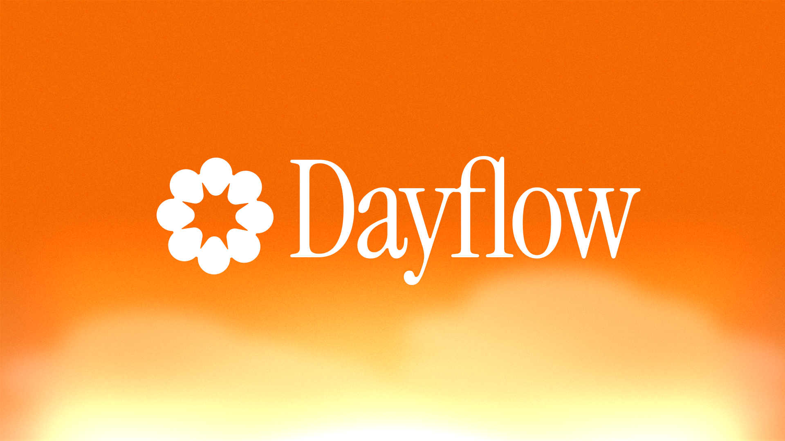

<div align="center">
  
</div>

<div align="center">
  <em>A timeline of your day, automatically.</em><br>
  Turns your screen activity into a clean timeline with AI summaries and distraction highlights.
</div>

<div align="center">
  <!-- Badges -->
  
  
  
  
  
</div>

<div align="center">
  
</div>

<p align="center">
  <a href="#quickstart">Quickstart</a> •
  <a href="#features">Features</a> •
  <a href="#how-it-works">How it works</a> •
  <a href="#installation">Installation</a> •
  <a href="#data--privacy">Data & Privacy</a> •
  <a href="#cost-notes-gemini">Cost notes (Gemini)</a> •
  <a href="#debug--developer-tools">Debug & Dev Tools</a> •
  <a href="#auto-updates-sparkle">Auto‑updates</a> •
  <a href="#releasing">Releasing</a> •
  <a href="#contributing">Contributing</a>
</p>

---

## What is Dayflow?

Dayflow is a **native macOS app** (SwiftUI) that records your screen at **1 FPS**, analyzes it **every 15 minutes** with AI, and generates a **timeline** of your activities with summaries. A built‑in **Debug** view lets you inspect each batch and every LLM request/response for full transparency.

> _Privacy‑minded by design_: You choose your AI provider. Use **Gemini** (bring your own API key) or **local models** (Ollama / LM Studio). See **Data & Privacy** for details.

<!-- Placeholder asset list removed for public release -->

---

## Features

- **Automatic timeline** of your day with concise summaries.
- **1 FPS recording** - minimal CPU/storage impact.
- **15-minute analysis intervals** for timely updates.
- **Timelapse videos** for each activity.
- **Auto storage cleanup** - removes old recordings after 3 days.
- **Distraction highlights** to see what pulled you off‑task.
- **Debug view** to replay batch video, expand cards, and inspect **every LLM call** (requests + responses, prettified JSON).
- **Native UX** built with **SwiftUI**.
- **Auto‑updates** with **Sparkle** (daily check + background download).
- **One‑button release** scripts for DMG signing, notarization, appcast updates, and GitHub Releases.

<!-- Feature screenshot placeholder removed -->

---

## How it works

1) **Capture** — Records screen at 1 FPS in 15-second chunks.  
2) **Analyze** — Every 15 minutes, sends recent footage to AI.  
3) **Generate** — AI creates timeline cards with activity summaries.  
4) **Display** — Shows your day as a visual timeline.  
5) **Cleanup** — Auto-deletes recordings older than 3 days.

<!-- Architecture diagram placeholder removed -->

---

## Quickstart

**Download (end users)**
1. Grab the latest `Dayflow.dmg` from **GitHub Releases**.
2. Open the app; grant **Screen & System Audio Recording** when prompted:  
   macOS → **System Settings** → **Privacy & Security** → **Screen & System Audio Recording** → enable **Dayflow**.

**Build from source (developers)**
1. Install **Xcode 15+** and open `Dayflow.xcodeproj`.
2. Run the `Dayflow` scheme on macOS 13+.
3. In your Run **scheme**, add your `GEMINI_API_KEY` under _Arguments > Environment Variables_ (if using Gemini).

---

## Installation

### Requirements
- macOS **13.0+**
- Xcode **15+**
- A **Gemini API key** (if using Gemini): https://ai.google.dev/gemini-api/docs/api-key

### From Releases
1. Download `Dayflow.dmg` and drag **Dayflow** into **Applications**.
2. Launch and grant the **Screen & System Audio Recording** permission.

### From source
```bash
git clone https://github.com/JerryZLiu/Dayflow.git
cd Dayflow
open Dayflow.xcodeproj
# In Xcode: select the Dayflow target, configure signing if needed, then Run.
```

---

## Data & Privacy

This section explains **what Dayflow stores locally**, **what leaves your machine**, and **how provider choices affect privacy**.

### Data locations (on your Mac)
- **App support folder:** `~/Library/Application Support/Dayflow/`
- **Recordings (video chunks):** `~/Library/Application Support/Dayflow/recordings/`
- **Local database:** `~/Library/Application Support/Dayflow/chunks.sqlite`
- **Recording details:** 1 FPS capture, analyzed every 15 minutes, 3-day retention
- **Purge / reset tip:** Quit Dayflow. Then delete the entire `~/Library/Application Support/Dayflow/` folder to remove recordings and analysis artifacts. Relaunch to start fresh.

> These paths are created by the app at first run. If you package Dayflow differently or run in a sandbox, paths may vary slightly.

### Processing modes & providers
- **Gemini (cloud, BYO key)** — Dayflow sends batch payloads to **Google’s Gemini API** for analysis.
- **Local models (Ollama / LM Studio)** — Processing stays **on‑device**; Dayflow talks to a **local server** you run.

### TL;DR: Gemini data handling (our reading of Google’s docs)
- **Short answer: yes.** If you **enable Cloud Billing** on **at least one** Gemini API project, Google treats **all of your Gemini API and Google AI Studio usage** under the **“Paid Services”** data‑use rules — **even when you’re using unpaid/free quota**. Under Paid Services, **Google does not use your prompts/responses to improve Google products/models**.  
  - Terms: “When you activate a Cloud Billing account, all use of Gemini API and Google AI Studio is a ‘Paid Service’ with respect to how Google Uses Your Data, even when using Services that are offered free of charge.” ([Gemini API Additional Terms](https://ai.google.dev/gemini-api/terms#paid-services-how-google-uses-your-data))  
  - Abuse monitoring: even under Paid Services, Google **logs prompts/responses for a limited period** for **policy enforcement and legal compliance**. ([Same Terms](https://ai.google.dev/gemini-api/terms#paid-services-how-google-uses-your-data))  
  - **EEA/UK/Switzerland:** the **Paid‑style data handling applies by default** to **all Services** (including AI Studio and unpaid quota) **even without billing**. ([Same Terms](https://ai.google.dev/gemini-api/terms#unpaid-services-how-google-uses-your-data))

**A couple useful nuances** (from docs + forum clarifications):
- **AI Studio is still free** to use; enabling billing changes **data handling**, not whether Studio charges you. ([Pricing page](https://ai.google.dev/gemini-api/docs/pricing))  
- **UI “Plan: Paid” check:** In **AI Studio → API keys**, you’ll typically see “Plan: Paid” once billing is enabled on any linked project (UI may evolve).  
- **AI Studio “Apps” environment**: one forum reply suggests that, for **Apps**, you may need to **explicitly link** your billing‑enabled **Cloud project** to that app for “Paid Services” to apply within Apps. We rely on the **Terms** for policy, but note the nuance.  
- **Workaround people ask about:** _“Make one project paid, keep using a free key elsewhere to get the best of both worlds.”_ The **Terms** imply **account‑level** coverage once any billing account is activated, but the **Apps** nuance above may limit this in specific UI contexts. **Treat this as an interpretation, not legal advice.**

> Sources: Official **Gemini API Additional Terms** (Paid vs Unpaid data use, EEA/UK/CH default), **Pricing** (Studio is free), and Google forum clarifications. Always review the current Terms for your use case.

### Local mode: privacy & trade‑offs
- **Privacy:** With **Ollama/LM Studio**, prompts and model inference run on your machine. LM Studio documents full **offline** operation once models are downloaded.  
- **Quality/latency:** Local open models are improving but **can underperform** cloud models on complex summarization.  
- **Power/battery:** Local inference is **GPU‑heavy** on Apple Silicon and will drain battery faster; prefer **plugged‑in** sessions for long captures.  
- **Future:** We may explore **fine‑tuning** or distilling a local model for better timeline summaries.

References:  
- LM Studio offline: https://lmstudio.ai/docs/app/offline  
- Ollama GPU acceleration (Metal on Apple): https://github.com/ollama/ollama/blob/main/docs/gpu.md

### Permissions (macOS)
To record your screen, Dayflow requires the **Screen & System Audio Recording** permission. Review or change later at:  
**System Settings → Privacy & Security → Screen & System Audio Recording**.  
Apple’s docs: https://support.apple.com/guide/mac-help/control-access-screen-system-audio-recording-mchld6aa7d23/mac

---

## Cost notes (Gemini)

Dayflow lets you bring your own Gemini key. Costs depend on **model**, **how many batches you analyze**, and **how many tokens** (input + output) each batch uses.

### A quick formula
```
Cost/day ≈ (#batches × input_tokens × input_rate + #batches × output_tokens × output_rate) / 1,000,000
```
> Use Google’s **token counting** helper in dev to measure real tokens: https://ai.google.dev/gemini-api/docs/token-counting

### Example scenarios (text/image/video analysis)
Using **Gemini 2.5 Flash (Standard)** prices — **Input: $0.30/M tokens**, **Output: $2.50/M tokens**  
See latest pricing: https://ai.google.dev/gemini-api/docs/pricing

| Scenario | Batches/day | Input tokens/batch | Output tokens/batch | Est. daily cost |
|---|---:|---:|---:|---:|
| Light (text + 1 image) | 24 | 2,000 | 200 | **$0.03** |
| Medium (short clip per batch) | 96 | 20,000 | 300 | **$0.65** |
| Heavy (longer clip per batch) | 160 | 64,000 | 500 | **$3.27** |

Same math with **Gemini 1.5 Flash (≤128k prompt)** — **Input: $0.075/M**, **Output: $0.30/M**:

| Scenario | Est. daily cost |
|---|---:|
| Light | **$0.01** |
| Medium | **$0.15** |
| Heavy | **$0.79** |

> **Notes:** Token counts for **video** inputs vary widely. Always measure your own prompts/files in development. For ultra‑low cost at scale, consider the **Batch API** (≈50% off interactive rates).

---

## Configuration

- **AI Provider**
  - Choose **Gemini** (set `GEMINI_API_KEY`) or **Local** (Ollama/LM Studio endpoint).  
  - For Gemini keys: https://ai.google.dev/gemini-api/docs/api-key
- **Capture settings**
  - Start/stop capture from the main UI. Use **Debug** to verify batch contents.
- **Data locations**
  - See **Data & Privacy** for exact paths and a purge tip.

---

## Debug & Developer Tools

Switch the top segmented control to **Debug** to:
- Play back the full **batch video**.
- Expand **timeline cards** to see summaries (and any inline video summaries).
- Inspect a list of **every LLM call** for the batch, including full request/response with prettified JSON.

<!-- Debug calls screenshot placeholder removed -->

---

## Auto‑updates (Sparkle)

Dayflow integrates **Sparkle** via Swift Package Manager and shows the current version + a “Check for updates” action. By default, the updater **auto‑checks daily** and **auto‑downloads** updates.

**One‑time setup**
1. Generate an **Ed25519** keypair using Sparkle’s `generate_keys`.
2. Add the public key to `Info.plist` under `SUPublicEDKey`.
3. Host your **appcast** (e.g., `docs/appcast.xml`) and set `SUFeedURL` accordingly.

**Key management tip (optional)**
- Store the private key in Keychain (Generic Password) and sign releases with a helper script — see `scripts/sparkle_sign_from_keychain.sh`.

**Appcast**
- Host at `docs/appcast.xml` on your default branch (enable **GitHub Pages**), or host the raw file.  
- Minimum system version is currently set to `13.0` in the appcast generation script.

Links:  
- Sparkle project: https://github.com/sparkle-project/Sparkle  
- Sparkle docs: https://sparkle-project.org/documentation/

---

## Releasing

### Local DMG build, sign, notarize
```bash
# First-time only: copy and edit your release env
cp scripts/release.env.example scripts/release.env
# Then:
chmod +x scripts/release_dmg.sh
./scripts/release_dmg.sh
# Outputs: Dayflow.dmg (stapled if notarization creds provided)
```

**Prereqs**
- Xcode toolchain
- Developer ID Application certificate in your login Keychain
- (Optional) `notarytool store-credentials` once, then export `NOTARY_PROFILE`, or pass Apple ID creds via env

### One‑button release (tag, build, upload, appcast)
```bash
# bump minor version by default
./scripts/release.sh
# also available:
./scripts/release.sh --major
./scripts/release.sh --patch
./scripts/release.sh --dry-run
```

What it does:
- Reads `CFBundleShortVersionString`/`CFBundleVersion` from `Dayflow/Dayflow/Info.plist`
- Bumps version/build and commits
- Builds, signs (+ notarizes if configured)
- Signs the DMG via Sparkle (`sign_update`)
- Creates a **draft** GitHub Release and uploads the DMG via `gh`
- Prepends a new `<item>` to `docs/appcast.xml`, commits, pushes, and **undrafts** the Release

**CI**  
Add a GitHub Actions workflow to call the scripts above on tagged pushes if you’d like fully automated releases.

---

## Project structure

```
Dayflow/
├─ Dayflow/                 # SwiftUI app sources (timeline UI, debug UI, capture & analysis pipeline)
├─ docs/                    # Appcast and documentation assets (screenshots, videos)
├─ scripts/                 # Release automation (DMG, notarization, appcast, Sparkle signing, one-button release)
└─ .github/workflows/       # (Optional) CI workflows for build/release
```

---

## Troubleshooting

- **Screen capture is blank or fails**  
  Check System Settings → Privacy & Security → **Screen & System Audio Recording** and ensure **Dayflow** is enabled.
- **API errors**  
  Verify your `GEMINI_API_KEY` and network connectivity.
- **Updates don’t appear**  
  Confirm `SUFeedURL` points to your published appcast and that the DMG asset URL + Sparkle signature match the uploaded release.

---

## Roadmap

- [ ] Export timeline summaries (Markdown/CSV)
- [ ] Per‑app grouping and filters
- [ ] Configurable chunk duration
- [ ] In‑app redaction controls for sensitive windows
- [ ] Optional local OCR pipeline for on‑device hints
- [ ] Beta update channel

---

## Contributing

PRs welcome! If you plan a larger change, please open an issue first to discuss scope and approach.  
_Lint/style preferences or Swift formatters can be added here if you use them._

---

## License

Licensed under the MIT License. See LICENSE for the full text.
Software is provided “AS IS”, without warranty of any kind.

---

## Acknowledgements

- [Sparkle](https://github.com/sparkle-project/Sparkle) for battle‑tested macOS updates.
- [Google AI Gemini API](https://ai.google.dev/gemini-api/docs) for analysis.
- [Ollama](https://ollama.com/) and [LM Studio](https://lmstudio.ai/) for local model support.
