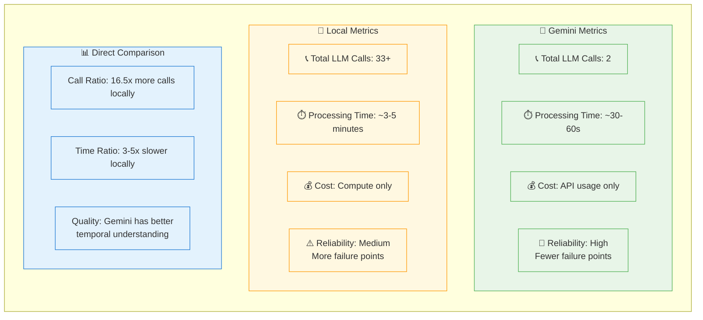
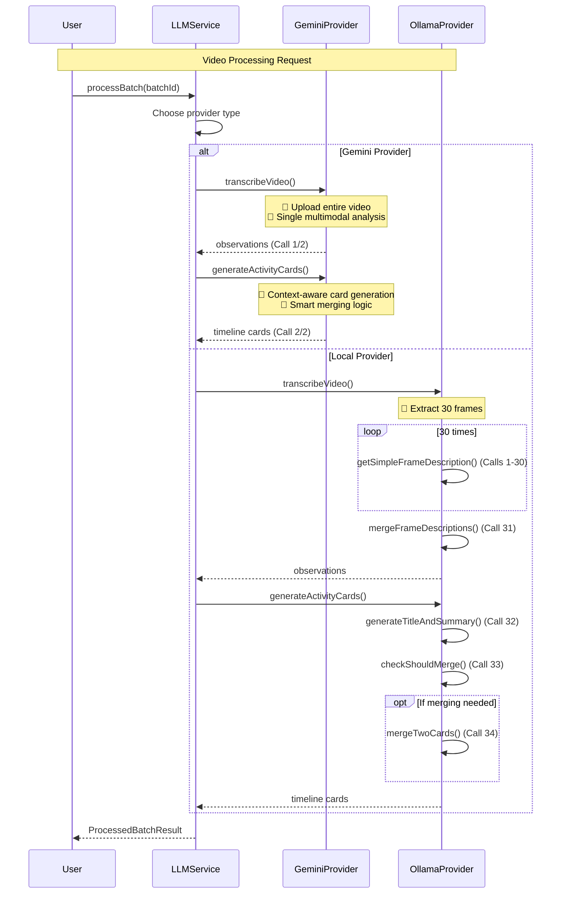

# LLM Processing Pipeline Comparison

## Gemini vs Local: Prompt Count Analysis

### Overview Diagram

```mermaid
flowchart TD
    V[🎥 15-minute Video Input] --> Decision{Choose Provider}

    Decision -->|API-based| G[🚀 Gemini Pipeline]
    Decision -->|Self-hosted| L[🔧 Local Pipeline]

    subgraph GP[" "]
        direction TB
        G1[📤 Step 1: Upload & Transcribe<br/>✨ Multimodal video analysis<br/>🎯 Extract 3-5 observations<br/>⚡ Single API call]
        G2[🎯 Step 2: Generate Activity Cards<br/>✨ Context-aware merging<br/>🎯 Timeline generation<br/>⚡ Single API call]
        G1 --> G2

        GResult[📊 Final Timeline Cards]
        G2 --> GResult
    end

    subgraph LP[" "]
        direction TB
        L1[📸 Step 1: Frame Extraction<br/>⚙️ Extract 30 frames @ 30s intervals<br/>🔧 Local processing]
        L2[👁️ Step 2: Frame Description<br/>🔄 30 parallel LLM calls<br/>📝 Describe each frame individually]
        L3[🔄 Step 3: Merge Descriptions<br/>⚡ 1 LLM call<br/>🧩 Combine into coherent segments]
        L4[📝 Step 4: Title & Summary<br/>⚡ 1 LLM call<br/>🏷️ Generate card metadata]
        L5[🤔 Step 5: Merge Decision<br/>⚡ 1 LLM call<br/>🔍 Check context compatibility]
        L6[🔗 Step 6: Card Merging<br/>⚡ 1 LLM call (conditional)<br/>🎯 Final card creation]

        L1 --> L2 --> L3 --> L4 --> L5 --> L6

        LResult[📊 Final Timeline Cards]
        L6 --> LResult
    end

    G --> GP
    L --> LP

    %% Styling
    classDef geminiBox fill:#e8f5e8,stroke:#4caf50,stroke-width:3px
    classDef localBox fill:#fff8e1,stroke:#ff9800,stroke-width:3px
    classDef geminiStep fill:#4caf50,color:#fff,stroke:#2e7d32
    classDef localStep fill:#ff9800,color:#fff,stroke:#ef6c00
    classDef result fill:#e3f2fd,stroke:#1976d2,stroke-width:2px
    classDef video fill:#f3e5f5,stroke:#7b1fa2,stroke-width:2px

    class GP geminiBox
    class LP localBox
    class G1,G2 geminiStep
    class L1,L2,L3,L4,L5,L6 localStep
    class GResult,LResult result
    class V,Decision video
```

### Detailed Call Count Breakdown



### Technical Implementation Flow



## Key Insights

**★ Efficiency Comparison ─────────────────────────────────────**
- **Gemini**: Leverages native video understanding for 16.5x fewer API calls
- **Local**: Reconstructs understanding from individual frame analysis
- **Trade-off**: API costs vs computational overhead and processing time
**─────────────────────────────────────────────────────────────**

## Code References

- **Gemini Pipeline**: `GeminiDirectProvider.swift:978` (transcribe), `GeminiDirectProvider.swift:1338` (cards)
- **Local Pipeline**: `OllamaProvider.swift:32` (main flow), `OllamaProvider.swift:233-276` (frame extraction)
- **Service Orchestration**: `LLMService.swift:111` (main processing logic)

## Usage

This diagram can be embedded in:
- GitHub README files
- Technical documentation
- Confluence/Notion pages
- Presentations (export as SVG/PNG)
- Jupyter notebooks

Simply copy the Mermaid code blocks into any platform that supports Mermaid rendering!